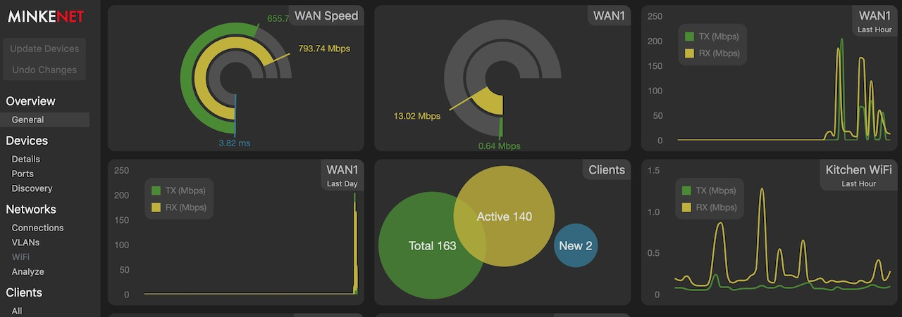

# MinkeNet: Unified Software Networking for cheap hardware

MinkeNet is an Open Source project which brings modern, unifying network monitoring and management tools to an expanding array of cheap, vendor agnostic, network switches, routers, firewall and wireless access points. The software provides a single, consistent UI which, regardless of the underlying hardware, allows complex cross device network structures (think VLANs, LAGs and WiFi networks) to be configured from a single interface.

## Why did you build this?

As is often the way, I had a specific problem to fix. Building VLANs across switches, especially cheap consumer switches, was error prone and fiddly; I'd gotten it wrong more times than I'd gotten it right. While part of the problem was a lack of visualization of what was in place, the biggest problem was that each switch I owned - whatever was on sale when I needed one - had different, tricky, fiddly configuration options. What I wanted was a single UI where I could construct my VLANs and get the configuration right the first time.

From that desire, the MinkeNet tool was born. At this point its goal has expanded to allow anyone to manage any set of cheap network hardware; a bit like a cross vendor UniFi controller if you like.

## Device Support

MinkeNet aims to support as much network hardware as possible. It currently supports the following manufacturer and devices:

* **D-Link** - DGS-1100-05
* **Engenius** - EAP1250
* **Mikrotik** - CSS106-5G-1S, CRS309-1G-8S+
* **Netgear** - GS305E, GS110EMX
* **TP-Link** - TL-SG105E, TL-SG108E, T2600G-28TS
* **Trendnet** - TEG-S80E, TEG-30284

The project will add and support as much popular and cheap hardware as time (and budget) allows.
